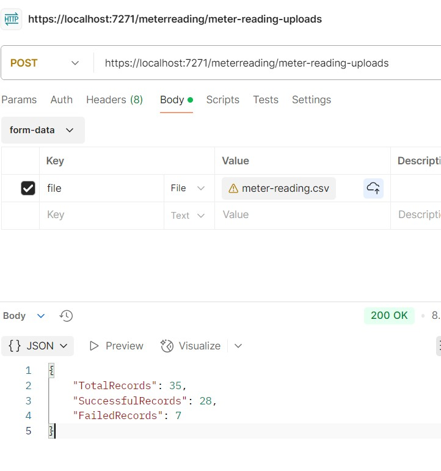
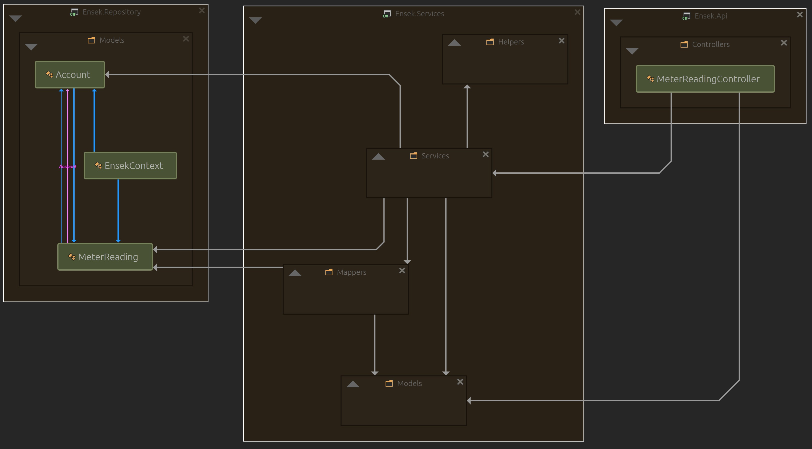

# ensek

## running the application end-to-end

### prepare a new database
* In the `~/db-scripts` folder, there's an ordered list of 3 `sql` scripts.
* Open up `MS SQL Server Management Studio`, and run the scripts <b>in the order below</b>.
* `01_create_db_ensek.sql` - creates the database.
* `02_create_tables.sql` - creates `Account` and `MeterReading` tables.
* `03_insert_table_data_accounts.sql` - inserts data provided in the `test-accounts.csv` file, into the `Account` table.


### run webapi project
* Open up Visual Studio, and set the `Ensek.Api` project as the startup project.
* Open `~/src/Ensek.Api/appsettings.json` file, and provide a valid database connection string for the `EnsekDatabase` field.
* The connection string generally uses the below format, but might vary depending on the authentication mechanism used to connect to the database.
   ```
    data source=<<SERVER_NAME>>;initial catalog=<<DATABASE_NAME>>;user id=<<USERNAME>>;password=<<PASSWORD>>
   ```
* Once you run the solution, it fires up a Swagger UI page.
* Make note of the port number (when running at my end, I use port `7271` specified in one of the profiles in the `~/src/Ensek.Api/Properties/launchSettings.json` file).
* You can verify the Api by trying either directly in the `Swagger UI` or via `Postman`.

<br/>



### run ui
* Go to `~/ui/src/api/meter-reading-api.tsx` and change the value of the `API_BASE_URL` variable to be the Api URL from above.
* Go to `~/ui/` folder and run `npm install` command, followed by `npm run dev`.
* Vite will then indicate which localhost port the UI will be available on, which you can then use to load the UI in a browser.


## decisions & assumptions:
* The database connection string would ideally be stored in a secret store of some sort, but for the purposes of this test, I decided that an environment configuration value would suffice.
* The trailing `,` at the end of each row in the `meter-reading.csv` file provided indicated the presence of a fourth item, but seeing as there was no `header` for it, I assumed it was unnecessary and have ignored it. There was only one item which had a value of `X` for this.
* Regarding the requirement of not having the same entry twice, I assumed it to mean to not have 2 entries with the same `AccountId` and `MeterReadingDateTime` value combination, regardless of the `MeterReadValue` itself.
* I assumed that the requirement of the `MeterReadingValue` format to be `NNNNN`, simply meant that it should be a whole integer i.e, `0 - 99999` range, and not `00001 - 99999`.
* Although I'd created a React-based UI for consuming the Api, considering that this requirement was a "Nice to have", I decided not to spend too much time to make it look sleek - it's just a very quick & simple `tsx` component with the bare-minimum elements necessary to be able to call the Api.


## depenency diagram
